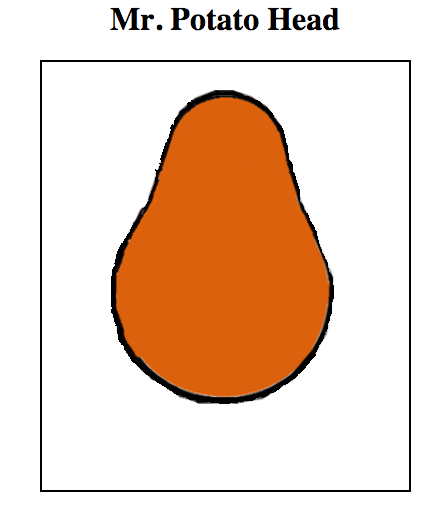
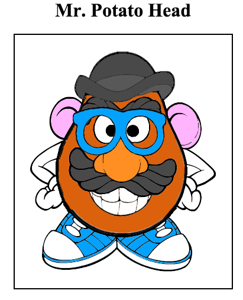

## What is Git

- a command-line tool (application) for Software Version Control.

## What is GitHub

- Code hosting website (GitHub to Code as Google Docs to documents editing/sharing).

## Practicing Git: Mr. Potatohead project

- **Fork** the following repo to your own GitHub:
	- `https://github.com/scripted-uasdc/Mr_Potato_Head.git`

- **Clone** it (from your GitHub) to Cloud9

- **Complete the task** of Mr. Potatohead project (add the body parts)

- **Commit** and **push** your changes back to your GitHub repo.

- Create a **pull request** to merge with the master repository.

# Project 1: Mr. Potato Head

## Before:

## After:

### References
* [Presentation Slides](https://docs.google.com/presentation/d/1eH0T3ESKY7AJQjtAL7_X4-uWqJRXwgKGguoAbmQmzRw/edit?usp=sharing)
* http://gitref.org/basic/
* https://try.github.io/levels/1/challenges/1
* http://en.wikipedia.org/wiki/Revision_control
* http://en.wikipedia.org/wiki/Git_(software)
* http://git-scm.com/docs/git-merge

### Guided Practice ("We do")

Add the following body parts to Mr. Potatohead's body:

* Arms
* Ears
* Eyes
* Mouth
* Nose
* Eyebrows
